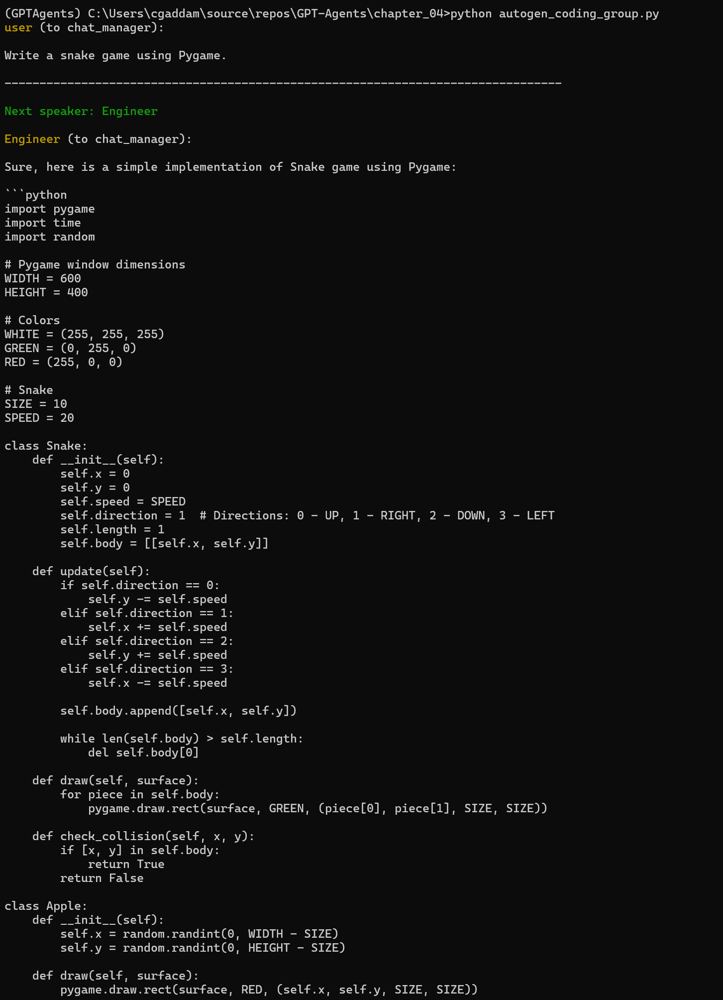
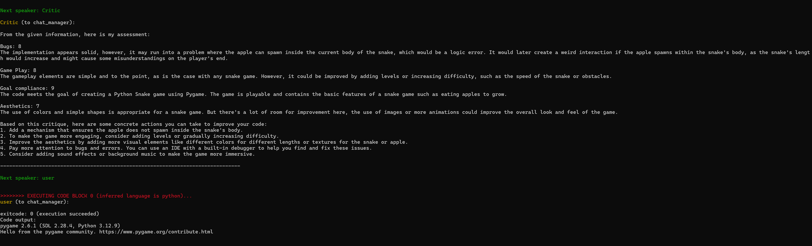
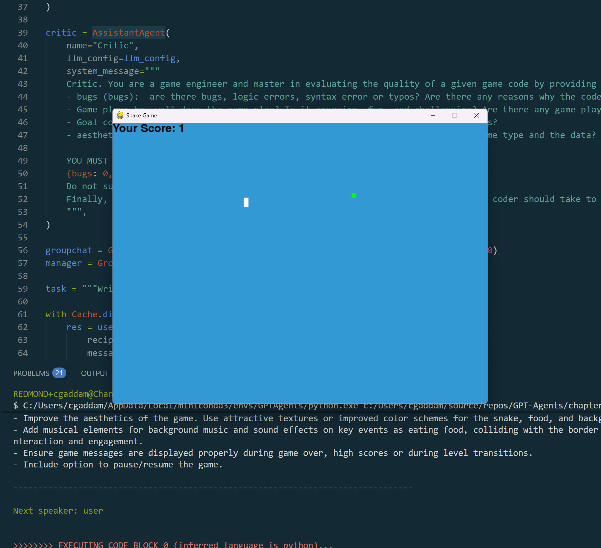

# AI Agents Coding Crew

This repository contains implementations of AI agent frameworks designed for collaborative code generation and evaluation, specifically focused on building games.

## Project Structure

The project is organized into two main approaches:

### AutoGen

The AutoGen implementation uses a group chat model with specialized agents:

- **Engineer**: A coding agent that writes clean, well-structured game code
- **Critic**: An evaluator agent that scores code across several dimensions:
  - Bugs and errors
  - Game play quality
  - Goal compliance
  - Aesthetics

The agents work together through a managed group chat to create and refine code based on a user's request.

Located in [`AutoGen/autogen_coding_group.py`](AutoGen/autogen_coding_group.py) with configuration stored in [`AutoGen/OAI_CONFIG_LIST`](AutoGen/OAI_CONFIG_LIST).

### CrewAI

The CrewAI implementation uses a sequential process with a different set of agents:

- **Senior Software Engineer**: Creates the initial code implementation
- **Software Quality Control Engineer**: Analyzes code for syntax errors and bugs
- **Chief Software Quality Control Engineer**: Ensures code functionality and quality

The user provides a game description, and the crew collaboratively builds the implementation through sequential tasks.

Located in [`CrewAI/crewai_coding_crew.py`](CrewAI/crewai_coding_crew.py) with environment variables stored in [`CrewAI/.env`](CrewAI/.env).

## Usage

### AutoGen Approach

Run the AutoGen implementation with:
```bash
cd AutoGen
pip install -r requirements.txt
python autogen_coding_group.py
```

### CrewAI Approach

Run the CrewAI implementation with:
```bash
cd CrewAI
pip install -r requirements.txt
python crewai_coding_crew.py
```

## Results

### AutoGen

Engineer generates code for the snake game:


Reviewer rates the code on different parameters:


Playing the game:
